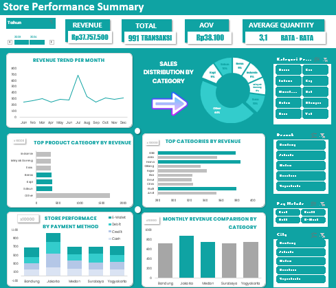

## 🖼 Dashboard Preview
[]

---

# 📊 Store Performance Analytics Dashboard

A fully interactive Excel-based data analytics project designed to analyze store performance across product categories, sales trends, customer behavior, and business KPIs.
This project transforms raw transactional data into a structured dashboard that provides actionable business insights.

---

## 🧠 Project Overview

This project analyzes store sales data over a 1+ year period with a total of 991 transactions.  
The goal is to understand revenue patterns, identify top-performing products, and evaluate overall business performance.

---

## 🎯 Objectives

- Analyze overall sales performance  
- Identify top-performing products  
- Understand monthly revenue trends  
- Evaluate city and branch performance  
- Analyze customer payment behavior  
- Generate business insights for decision-making  

---

## 📑 Dataset Information

| Information         | Value        |
|--------------------|-------------|
| Total Transactions | 991         |
| Period             | 2023–2024   |
| Data Format        | Excel / CSV |
| Data Type          | Transactional Sales Data |

### Main Columns:
- Transaction ID  
- Date  
- Customer Name  
- Product  
- Quantity  
- Price  
- Total Revenue  
- Payment Method  
- Branch  
- City  

---

## 🛠 Tools & Techniques

- Microsoft Excel  
- Pivot Tables  
- Pivot Charts  
- Slicers (Interactive Filtering)  
- Data Cleaning Techniques  
- Excel Formulas:
  - SUM
  - AVERAGE
  - COUNTIF
  - IF
  - LEN
  - MID  

---

## 🧹 Data Cleaning Process

- Removed duplicate data  
- Standardized text format  
- Fixed inconsistent date formats  
- Cleaned unnecessary characters/noise  
- Created calculated columns (Revenue, AOV, etc.)  

---

## 📊 Key Performance Indicators (KPI)

- **Total Revenue** → Overall income generated  
- **Total Transactions** → Number of successful sales  
- **Average Order Value (AOV)** → Revenue per transaction  
- **Average Quantity per Order**  
- **Best Performing Product**  
- **Best Performing City**  

---

## 📈 Dashboard Features

- Monthly Revenue Trend Analysis  
- Top Product Performance  
- City/Branch Performance Comparison  
- Payment Method Distribution  
- Interactive Filters (Slicers)  
- KPI Summary Section  
- Multi-page Excel Dashboard:
  - Home  
  - Dashboard  
  - KPI Summary  
  - About Data  
  - Insights  
  - Contact Page  

---

## 🔍 Key Insights

- Sales performance is generally stable with a significant spike in July, indicating possible seasonal demand.  
- Essential products such as **soap and cooking oil** dominate revenue, showing strong daily-consumption behavior.  
- The **credit payment method** is the most frequently used, suggesting customer preference for non-cash transactions.  
- Revenue across cities is relatively balanced, with **Jakarta contributing the highest sales**.  
- Limited additional data (such as promotions or external factors) restricts deeper analysis, but trends indicate strong potential for growth.  

---

## 🚀 Business Recommendations

- Focus on promoting essential products to maintain consistent revenue growth.  
- Leverage mid-year campaigns (around July) to maximize seasonal demand.  
- Expand marketing efforts through digital campaigns and offline promotions (e.g., banners, ads).  
- Strengthen distribution channels to increase overall sales volume.  
- Collect additional data (promotion, campaign, customer behavior) for deeper analysis in the future.  

---

## 📂 Project Structure
store-performance-project/ 
│ 
├── data/ 
│   └── store_data.xlsx 
│ 
├── website/ 
│   ├── index.html 
│   ├── style.css 
│   ├── script.js 
│   └── src/ 
│ 
├── images/ 
│   └── dashboard-preview.png 
│ 
└── README.md

---

## 📬 Contact

If you are interested in collaboration or discussion:

- Email: 1mraffaizzelh@gmail.com  
- GitHub: https://github.com/RaffaHmii  

---

## 💡 About The Author

A high school student and aspiring Data Analyst who is passionate about data, business insights, and building real-world projects.

---

## ⭐ Final Note

This project demonstrates the complete data analysis workflow:
**Raw Data → Data Cleaning → Analysis → Visualization → Insight → Dashboard**
It reflects the ability to not only process data but also transform it into meaningful business decisions.
